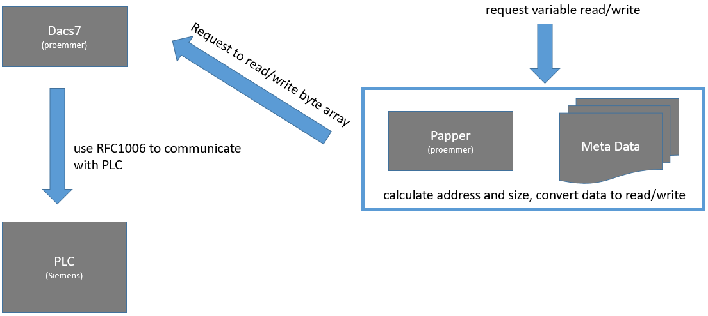

# webpac-docs
(web based plc data access)

By [Benjamin Proemmer](https://github.com/proemmer)

Webpac is a software which offers an web-interface for accessing Step7 PLC's. 
This interface enables you to read and write to/from PLC.
Furthermore it supports the functionality to subscribe for events if data changes.

The project is hosted on github [webpac](https://github.com/proemmer/webpac)


## running the application

To start webpac, you have to run the following command:


after this the application runs in the command window:


## Absolute (address based access)

The first method to read and write data is by its absolute address.
To address a value in the PLC you have to specify the area and the type.

### Area
| Area | Name  |
| ---------| --------------- |
| DB[Number] | datablock |
| FB | Flags |
| IB | Input |
| OB | Output |
| TB | Timer |
| CB | Counter |

### Address

[Code][Offset][_Length]

| Code | Type  |
| ---------| --------------- |
| BIT | Boolean |
| B   | Byte |
| BYTE| Byte |
| C   | Char |
| CHAR| Char |
| DATE | Date |
| DT | DateTime |
| DATETIME | DateTime |
| DI | Double Integer |
| DINT | Double Integer |
| I | Integer |
| INT | Integer |
| R | Real |
| REAL | Real |
| TIMEBCD | S7 Time |
| S | String |
| STRING | String |
| T | Time |
| TIME | Time |
| TOD | TimeOf Day |
| W | Word |
| WORD | Word |
| CT | Counter |
| COUNT | Counter |


## Symbolic (symbol based access)

The second access method is by its symbolic name. For this, you have to create a 
data-mapping file. The structure of this file is an C# class with properties. 
To create such a file is very easy, you could use a tool from 
[insite-gmbh](http://www.insite-gmbh.de) called AWLConverter. 
This tool extracts the data from the Simatic Manager and converts it 
to the representation we use. 


##web api

To visualize and test the web api we added swagger support. Whit this, 
you can also generate a proxy to easily call webpac from your C# application.


##Configuration


### Logging

In this section you can configure the logging for the application. (For details have a look at [docs.asp.net](https://docs.asp.net/en/latest/fundamentals/logging.html#configuring-logging-in-your-application))

```c#
  "Logging": {
    "IncludeScopes": false,
    "LogLevel": {
      "Default": "Information",
      "System": "Information",
      "Microsoft": "Information"
    }
  }
```


### Global

The *Global* section can be used to deactivate some features. (The shown settings are default)

```c#
  "Global": {
      "UseSignalR": true,
      "UseWebSockets": true,
      "UseSwagger ":  true,
      "UseLogFiles" :  true
    }
```

*   *UseSignalR*: If false, SignalR is not activated and data change call back is not available. 
*   *UseWebSockets*: If false, wepac do not use websockets and so it tries to find a other supported method.
*   *UseSwagger*: If false, swagger is not activated, an so u could not use swagger ui.
*   *UseLogFiles*: If false, no log file will be created. If true, webpac uses the nlog.config file for log file configuration.

### Plc

This section specifies the connection parameter to the PLC.

```c#
  "Plc": {
    "ConnectionString": "Data Source=127.0.0.1:102,0,2",
    "ConnectOnStartup": true,
    "ReconnectOnConnectionLost": true,
    "ReconnectIntervall":  5000
  }
```

*   *ConnectionString*: Defines the address to the PLC. Syntax: [IP]:[PORT],[RACK],[SLOT]
*   *ConnectOnStartup*: If this value is *true*, webpac try connecting to PLC at the application start.
*   *ReconnectOnConnectionLost*: If this value is *true*, webpac tries to reconnect, when PLC connection goes down.
*   *ConnectReconnectIntervallOnStartup*: This value specifies the connection retry interval.

### RuntimeCompiler

```c#
  "RuntimeCompiler": {
    "Location": "C:\\webpac\\data",
    "Usings": [
      "System",
      "Papper.Attributes"
    ]
  }
```
*   *Location*: This value specifies the Location of the symbolic file (C# class files).
*   *Usings*: This is an array of usings depending of the class files you want compile.


### Authentication

```c#
  "Auth": {
    "KeyFile": "C:\\webpac\\data\\sec.key",
    "TokenValidatenTimeinMinutes": 1440 ,
    "Users": [
      {
        "Type": "ReadOnly",
        "Username": "ReadOnlyUsername",
        "Password": "ReadOnlyPassword"
      },
      {
        "Type": "ReadWrite",
        "Username": "ReadWriteUsername",
        "Password": "ReadWritePassword"
      }
    ]
  }
```

*   *KeyFile*: This value specifies the Location of the key file for the authentication token (this file will be created on first start).
*   *TokenValidatenTimeinMinutes*: This value specifies the validation time of the token.
*   *Users.Type*: Select the access level for the api calls [Valid parameters are ReadOnly, ReadWrite]
*   *Users.Username*: Name of the user for sign in.
*   *Users.Password*: Password for the specified user.

##File based Logging

To write to log files, webpac use [NLog](http://nlog-project.org/). 
(For configuration details, see the webpage of the project.)

##Used Libraries

To get the PLC access we use two libraries as the following image describe.



###Papper

[Papper](http://proemmer.github.io/papper) is a data mapper which maps a C# class to a PLC data block.
This package is also available as a [nuget](https://www.nuget.org/packages/Papper/) package.


### Dacs7

[DacS7](http://proemmer.github.io/dacs7/) is a low level component which handles the communication to the 
PLC and is available as a [nuget](https://www.nuget.org/packages/Dacs7/) package.


