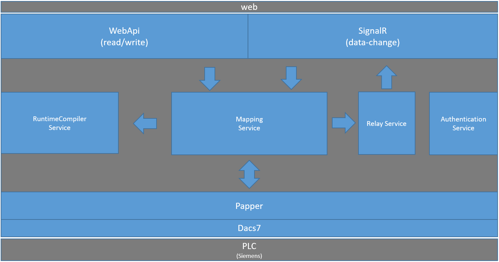

# webpac-docs
(web based plc data access)

By [Benjamin Proemmer](https://github.com/proemmer)

Webpac is a software which offers an web-interface for accessing Step7 plc's. 
This interface gave you the opportunity to read from the pc and also write to it.
Furthermore it supports the functionality to subscribe to get informed if some data 
has been changed.

## running the application

To start webpac, you have to run the following command:

after this the application runs in the command window:

## Absolute (address based access)

The first method to read and write data is by its absolute address.
To address a value in the plc you have to specify the area and the type.

### Area
| Area | Name  |
| ---------| --------------- |
| DB[Number] | datablock |
| FB | Flags |
| IB | Input |
| OB | Output |
| TB | Timer |
| CB | Counter |

### Address

[Code][Offset][_Length]

| Code | Type  |
| ---------| --------------- |
| BIT | Boolean |
| B   | Byte |
| BYTE| Byte |
| C   | Char |
| CHAR| Char |
| DATE | Date |
| DT | DateTime |
| DATETIME | DateTime |
| DI | Double Integer |
| DINT | Double Integer |
| I | Integer |
| INT | Integer |
| R | Real |
| REAL | Real |
| TIMEBCD | S7 Time |
| S | String |
| STRING | String |
| T | Time |
| TIME | Time |
| TOD | TimeOf Day |
| W | Word |
| WORD | Word |
| CT | Counter |
| COUNT | Counter |

## Symbolic (symbol based access)

The second access method is by its symbolic name. For this, you have to create a 
data-mapping file. The structure of this file is an C# class with properties. 
To create such a file very easy, you could use a tool from 
[insite-gmbh](http://www.insite-gmbh.de) called AWLConverter. 
This tool extracts the data from the Simatic Manager and convert it 
to the representation we use. 

##web api

To visualize and test the web api we add swagger support.

##Used Libraries

To get the plc access we use two libraries.

### Dacs7

[DacS7](http://proemmer.github.io/dacs7/) is a low level component which handles the communication to the 
plc and is available as a [nuget](https://www.nuget.org/packages/Dacs7/) package.

###Papper

[Papper](http://proemmer.github.io/papper) is a data mapper which maps a c# class to a plc data block.
This package is also available as a [nuget](https://www.nuget.org/packages/Papper/) package.

